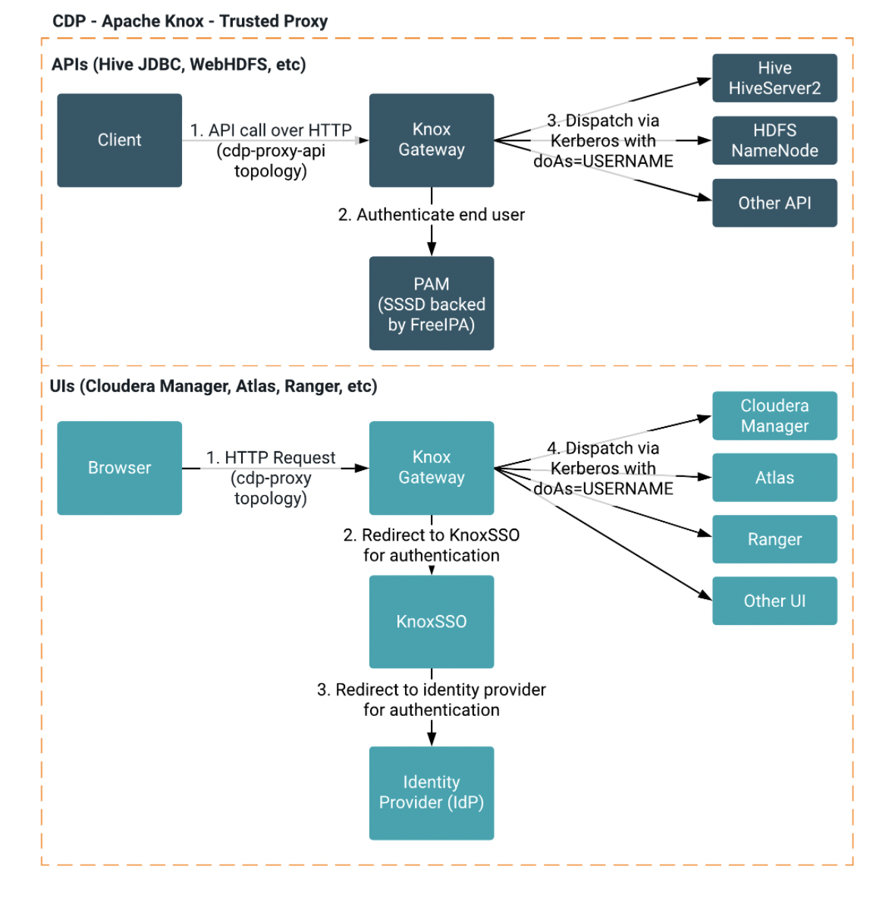
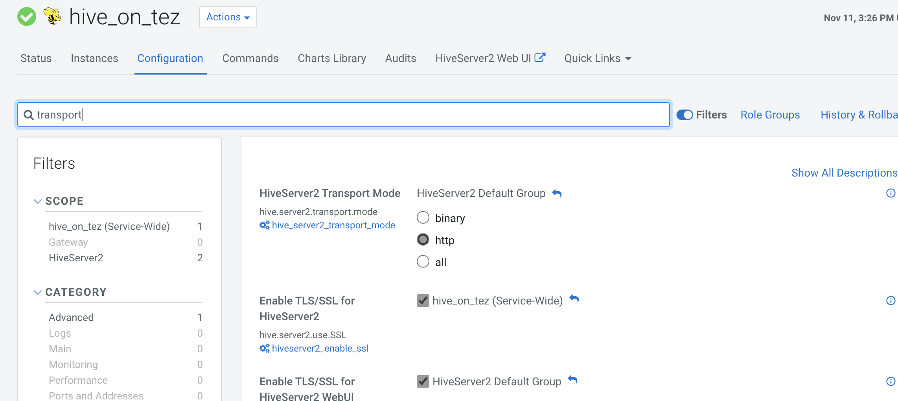
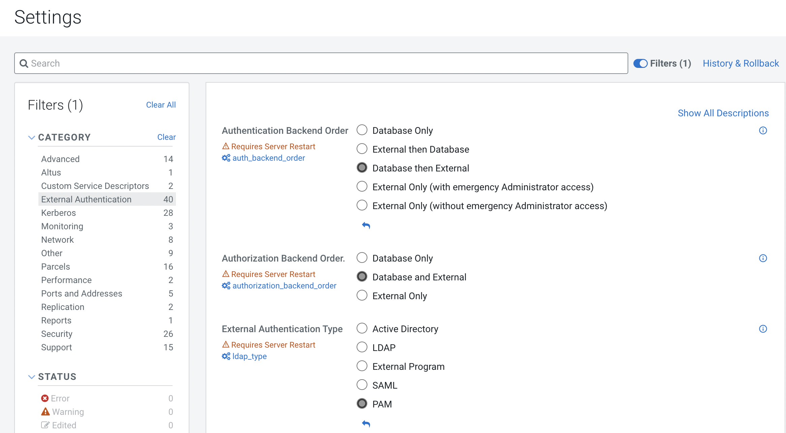
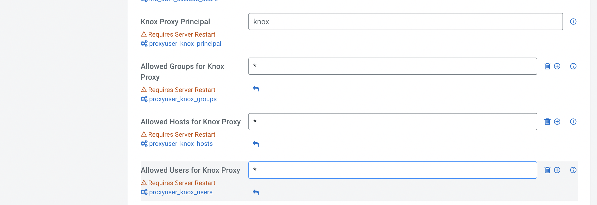
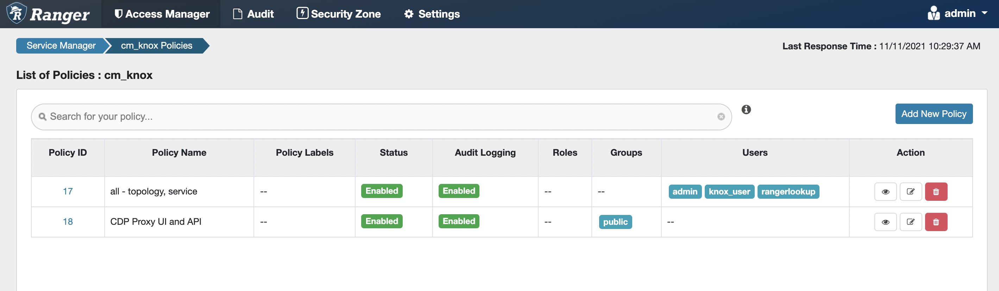
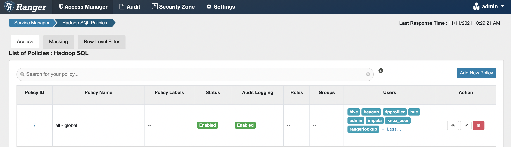
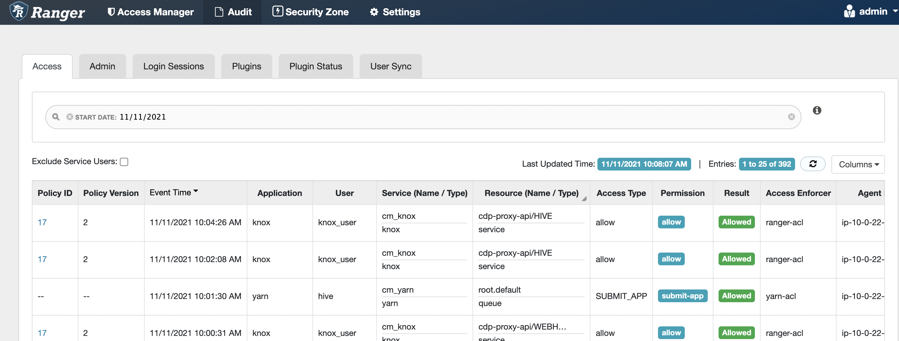

From Cloudera Documentation:<br>
https://docs.cloudera.com/runtime/7.2.0/cdp-security-overview/topics/security-authentication-with-knox.html<br><br>
<br>
<br>
<br>
<br>
<br>
<br>
<br>

## Use PAM external authentication to create a local user just for testing. 
### AD or LDAP recommended for Production use cases
```
groupadd shadow
usermod -G root,shadow root
usermod -G knox,hadoop,shadow knox
chgrp shadow /etc/shadow
chmod g+r /etc/shadow

useradd -G hadoop knox_user
passwd knox_user
```

## Get the Public Certificate for the Knox Gateway
```
openssl s_client -connect localhost:8443 | openssl x509 -out /tmp/knox.crt
```
## Import the Cert into the Truststore on the JDBC clients
```
keytool -import -trustcacerts -keystore /etc/pki/java/cacerts -storepass changeit -noprompt -alias knox -file /tmp/knox.crt
```

## The JDBC URL string to use
```
"jdbc:hive2://<Knox gateway host>:8443/;ssl=true;transportMode=http;httpPath=gateway/cdp-proxy-api/hive"

Remember to specify the knox_user name and password
```


